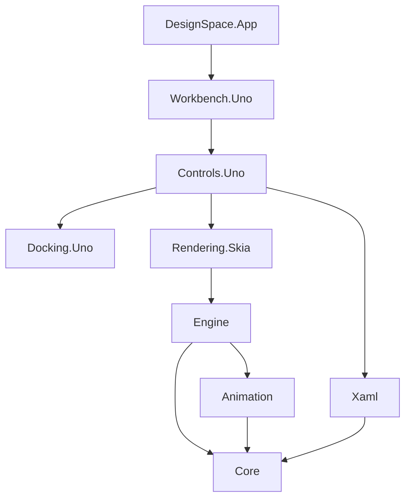

# Architecture and integration

## Dependency boundaries



There are eight packable libraries and one non-packable host application. Portable packages target .NET 10; Uno packages target `net10.0-desktop` and `net10.0-browserwasm`. `DesignSpaceTargetFrameworks` narrows the framework set for a platform-specific build. Do not set it when packing a complete dual-target Uno library.

## Document and editing contracts

`DesignDocument` and `DesignNode` are immutable records. Node identities are stable GUIDs; properties use expanded XML names when namespaced. Unknown property elements are retained as XML strings rather than turned into executable objects. Storyboards and states refer to node identities, not fragile list positions.

`DesignSession.Execute(label, transform, selection)` validates the proposed document before changing the live session. History retains the before/after documents and selection, is bounded to 100 entries by default, and clears the redo branch on a new edit. Use `Load` for replacing a document, `MarkSaved` only after a successful host save, and `DocumentChanged` / `SelectionChanged` to refresh consumers. UI interaction belongs on the host UI thread; the session is not a thread-safe shared mutable service.

```csharp
var session = new DesignSession(DesignDocument.Empty());
var id = session.Add("Rectangle", new DRect(24, 32, 160, 96));
session.SetProperty("Fill", "#FF0078D4");
var layout = new LayoutEngine().Arrange(session.Document.Root);
var picked = layout.HitTest(new DPoint(40, 50));
```

The layout engine is a portable design-time subset, not an implementation of the entire WinUI/WPF dependency-property and layout system. See [compatibility](compatibility.md) before integrating arbitrary XAML.

## Rendering ownership

`DesignRenderer` accepts a caller-owned `SKCanvas`. It never creates an application window or selects a native GPU API. This allows the same drawing code to render into Uno's compositor, a native Skia surface, or a CPU export surface.

```csharp
using var renderer = new DesignRenderer();
var layout = new LayoutEngine(renderer).Arrange(session.Document.Root);
renderer.DrawScene(yourCanvas, layout);
byte[] png = renderer.ExportPng(layout, scale: 2);
```

The consumer supplies the appropriate Skia native/runtime assets. The application uses the version family required by Uno rather than mixing incompatible Skia packages. `DesignTypography.DefaultTypeface` may be assigned before constructing renderers; its ownership remains with the host. The WebAssembly host loads a framework-supplied licensed typeface so the artboard does not depend on fonts installed on the server or end user's operating system.

Dispose renderers to release cached fonts, paths and paints. Layout/scene indexes are reused until the document or animation preview changes. The renderer's duration metric is CPU submission work; the host would need GPU timestamp queries and presentation measurements for GPU or end-to-end latency.

## Uno composition

Individual controls accept a shared session:

```csharp
var session = new DesignSession();
var designer = new DesignerSurface(session);
var properties = new PropertyInspector(session);
var outline = new OutlineControl(session);
var timeline = new TimelineControl(session);
```

The full shell is `WorkbenchView(IWorkbenchPlatform platform, DesignDocument? document = null)`. Add it to your window, then call `InitializeAsync` after mounting. Dispose it when the host closes. Individual controls expose their own change/error events and can be arranged without the workbench or docking package's complete workspace.

`IWorkbenchPlatform` is the boundary for open/save dialogs, local persistence and clipboard access. The application implementation uses browser downloads and local storage in WebAssembly, and platform storage/pickers on desktop. The libraries themselves do not call JavaScript globals or assume filesystem paths.

## XAML and recovery

`XamlCodec.Parse` uses an XML reader with DTD processing prohibited and external resolution disabled. It creates inert model data, not runtime controls. `XamlCodec.Write` exports the supported design model and retained property markup. `Reconcile` preserves named element identities and locks when applying source edits.

The source editor keeps its own draft, canonical text and base revision. It compares the actual text accepted by Uno after line-ending normalization. Applying a draft against a different document revision fails explicitly; invalid source remains editable. This is deliberate conflict protection, not a continuously executing live-code environment.

`NativeDocumentCodec` uses System.Text.Json source-generated metadata so immutable collections work in trimmed WebAssembly without reflection-generated collection delegates. Native documents preserve locks, identities, state setters and keyframes. The versioned recovery envelope also retains a source draft and pane sizes/hidden state. Recovery is local, debounced and quota-dependent, and must not be treated as a backup.

## Tests and release gates

Portable tests exercise editing, selection, layout, animation and transaction rollback. Compatibility tests exercise source generation, native and XAML round trips, strict preservation boundaries and non-executing sample data. The compatibility executable is also published trimmed with reflection serialization disabled and run again.

Browser verification drives actual pointer/keyboard input. The opt-in `?diagnostics=1` snapshot exposes read-only model state and rendered control bounds; it contains no command dispatcher or test mutation API. CI retains screenshots, logs, state and test results to distinguish successful compilation from a functioning UI. Desktop compilation is tested independently on three operating systems.


## Storyboard clocks and state authoring

`StoryboardClock.Sample(board, elapsed)` is a deterministic, timer-free API returning local keyframe time, whether animation contributes, and completion state. `AnimationEngine.Evaluate` consumes elapsed playback time; `EvaluateLocal` samples the original keyframe interval directly. Keep these coordinates separate when building a timeline. `TimelineControl.PreviewStoryboard`/`PreviewTime` provide the appropriate preview pair for the existing designer-surface API.

`StoryboardSettingsControl` produces an updated immutable storyboard without committing it. `StoryboardInspectorControl` composes it with a session and timeline, validates settings in a transaction, and rejects stale drafts. `AnimationEngine.ChangeDuration` either scales key times or rejects a duration that would exclude existing keys.

`StateEditing.SetProperty` and `RemoveProperty` are portable, pure operations. Recording preserves the base root reference, respects inherited locks, validates supported values and avoids duplicate setters/no-op history. Preview coalesces state and animation values into one tree transformation. A recorded scalar brush replaces a conflicting inline brush only in the preview tree.

```csharp
var node = session.Document.Root.Children[0];
var board = new DesignStoryboard(Guid.NewGuid(), "Entrance", 1,
    [new(node.Id, "Opacity", [new(0, 0), new(1, 1, "EaseOut")])])
{
    BeginTime = 0.2,
    SpeedRatio = 2,
    AutoReverse = true,
    RepeatCount = 3
};
var clock = StoryboardClock.Sample(board, elapsed: 0.7);
var preview = AnimationEngine.Evaluate(session.Document.Root, board, 0.7);
```

## Cache and measurement contracts

`SkiaTextService` owns reusable paints, font/shaper resources, a glyph-run LRU and a wrapped-line LRU. Keys include text, family/style, size and width as relevant. Entry count and estimated resource-cost budgets bound retention; they do not measure all managed/native allocator overhead. The service and its caches are UI-thread objects, not concurrent collections.

`IStyledTextMetrics` lets a host measure the same font weight/style, wrapping and line-height settings it draws. `DesignRenderer` implements it so the layout engine no longer measures every styled node as plain text. The fallback portable metrics remain approximate. Warm-paragraph and cache-churn regressions check work avoidance, separately from elapsed-time benchmarks.

## Vector geometry and authoring

`VectorPath`, `VectorFigure` and `VectorSegment` are immutable portable Core contracts. `VectorPathCodec` parses finite XAML/SVG-style commands and canonicalizes using invariant round-trip numeric formatting. `VectorMath` computes exact curve extrema, evaluates/subdivides segments and lazily creates bounded hit-test edges. `VectorGeometry` adapts literal and supported object-form XAML geometry without executing markup extensions.

`PathEditing` is an Engine-only library surface: moving anchors/handles, subdivision, point and edge deletion, open/close, line/curve conversion and bounded freehand simplification. The original path stays immutable. Inserting a Bezier point uses de Casteljau subdivision rather than fitting a new curve.

```csharp
var path = VectorPathCodec.Parse("M0 0 C0 100 100 100 100 0");
var divided = PathEditing.Insert(path, figureIndex: 0, segmentIndex: 0, time: 0.5);
var moved = PathEditing.Move(divided,
    new PathHandle(0, 0, PathHandleKind.Anchor), new DPoint(50, 60));
string data = VectorPathCodec.Write(moved);
```

`SkiaVectorGeometry.Create` returns a caller-owned native path; `Combine` returns portable geometry. `PathCommands` composes conversion, native boolean operations and clipping with the session's validation/history. `PathAdornerRenderer` draws fixed-screen-size control points into a caller-owned canvas. `PathToolsControl` and `DesignerSurface` provide the reusable Uno interaction layer.

Pen and Pencil drafts stay outside the document until completed. Direct point manipulation uses a frozen source geometry, transform and revision throughout the gesture, then commits once on release. Cancellation discards the preview. External document changes invalidate drafts instead of overwriting newer work. The read-only diagnostic snapshot reports handle positions relative to the designer surface; browser tests add the surface's page offset before sending pointer input.

The renderer's native path cache keys geometry and transform separately from paint. Pan/zoom of the surrounding scene does not rebuild ordinary scene paths. Bounds requests do not eagerly flatten curves; hit-test tessellation is lazy and weakly cached. All native paths and adorner resources are released when their owning renderer is disposed. These UI-thread caches must not be shared concurrently.

See the compatibility matrix for affine arc approximation, destructive-operation guards and geometry limits. Neither native booleans nor adaptive picking assert bitwise equivalence to Microsoft Blend/WPF geometry processing.


## Batch anchor editing

`PathAnchorEditing` in Engine exposes selection normalization, transformed rectangular queries, `Translate`, `MoveTo`, `Remove`, `Align` and `Distribute` independently of Uno. Anchor handles identify a figure and segment endpoint; `Segment=-1` identifies the figure start. An explicit closing endpoint coincident with that start is normalized to the same anchor. Tangent handles are not valid anchor selections.

```csharp
var geometry = VectorPathCodec.Parse("M0 0C10 20 20 20 30 0L60 0");
var points = PathAnchorEditing.Selection(geometry,
    [new(0, -1, PathHandleKind.Anchor), new(0, 0, PathHandleKind.Anchor)]);
var moved = PathAnchorEditing.Translate(geometry, points, new DPoint(8, 0));
var aligned = PathAnchorEditing.Align(moved, points, "Top", DMatrix.Identity);
```

The APIs return immutable geometry without committing a session. Batch move/delete use one traversal per affected figure and retain unaffected figure references; distribution additionally sorts selected coordinates. `MoveTo` rejects nonfinite or out-of-budget coordinates before returning a replacement. Shared quadratic controls follow the average of two selected endpoint displacements; cubic controls follow their associated endpoint. Skipped anchors are bridged on deletion, retaining adjacent segments and suitable cubic tangents. A figure with fewer than two survivors is removed.

`DesignerSurface.SelectedPathAnchors` exposes the current read-only point set. Pointer previews use the frozen source geometry and commit through one `DesignSession.Execute` on release. Source revision checks prevent applying a drag over a changed document. Cancelling restores the prior point selection for a marquee and discards preview geometry. Point selection is not serialized or added to document history. A host can use the optional selected-anchor set in `PathAdornerRenderer.Draw` without the complete workbench.
