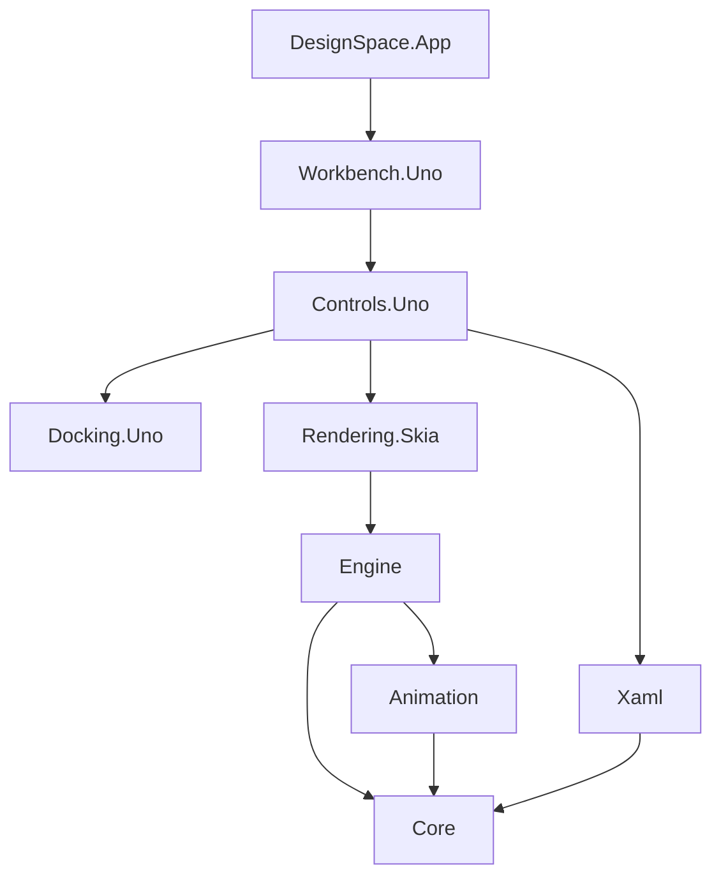

# Architecture and integration

## Dependency boundaries



There are eight packable libraries and one non-packable host application. Portable packages target .NET 10; Uno packages target `net10.0-desktop` and `net10.0-browserwasm`. `DesignSpaceTargetFrameworks` narrows the framework set for a platform-specific build. Do not set it when packing a complete dual-target Uno library.

## Document and editing contracts

`DesignDocument` and `DesignNode` are immutable records. Node identities are stable GUIDs; properties use expanded XML names when namespaced. Unknown property elements are retained as XML strings rather than turned into executable objects. Storyboards and states refer to node identities, not fragile list positions.

`DesignSession.Execute(label, transform, selection)` validates the proposed document before changing the live session. History retains the before/after documents and selection, is bounded to 100 entries by default, and clears the redo branch on a new edit. Use `Load` for replacing a document, `MarkSaved` only after a successful host save, and `DocumentChanged` / `SelectionChanged` to refresh consumers. UI interaction belongs on the host UI thread; the session is not a thread-safe shared mutable service.

```csharp
var session = new DesignSession(DesignDocument.Empty());
var id = session.Add("Rectangle", new DRect(24, 32, 160, 96));
session.SetProperty("Fill", "#FF0078D4");
var layout = new LayoutEngine().Arrange(session.Document.Root);
var picked = layout.HitTest(new DPoint(40, 50));
```

The layout engine is a portable design-time subset, not an implementation of the entire WinUI/WPF dependency-property and layout system. See [compatibility](compatibility.md) before integrating arbitrary XAML.

## Rendering ownership

`DesignRenderer` accepts a caller-owned `SKCanvas`. It never creates an application window or selects a native GPU API. This allows the same drawing code to render into Uno's compositor, a native Skia surface, or a CPU export surface.

```csharp
using var renderer = new DesignRenderer();
var layout = new LayoutEngine(renderer).Arrange(session.Document.Root);
renderer.DrawScene(yourCanvas, layout);
byte[] png = renderer.ExportPng(layout, scale: 2);
```

The consumer supplies the appropriate Skia native/runtime assets. The application uses the version family required by Uno rather than mixing incompatible Skia packages. `DesignTypography.DefaultTypeface` may be assigned before constructing renderers; its ownership remains with the host. The WebAssembly host loads a framework-supplied licensed typeface so the artboard does not depend on fonts installed on the server or end user's operating system.

Dispose renderers to release cached fonts, paths and paints. Layout/scene indexes are reused until the document or animation preview changes. The renderer's duration metric is CPU submission work; the host would need GPU timestamp queries and presentation measurements for GPU or end-to-end latency.

## Uno composition

Individual controls accept a shared session:

```csharp
var session = new DesignSession();
var designer = new DesignerSurface(session);
var properties = new PropertyInspector(session);
var outline = new OutlineControl(session);
var timeline = new TimelineControl(session);
```

The full shell is `WorkbenchView(IWorkbenchPlatform platform, DesignDocument? document = null)`. Add it to your window, then call `InitializeAsync` after mounting. Dispose it when the host closes. Individual controls expose their own change/error events and can be arranged without the workbench or docking package's complete workspace.

`IWorkbenchPlatform` is the boundary for open/save dialogs, local persistence and clipboard access. The application implementation uses browser downloads and local storage in WebAssembly, and platform storage/pickers on desktop. The libraries themselves do not call JavaScript globals or assume filesystem paths.

## XAML and recovery

`XamlCodec.Parse` uses an XML reader with DTD processing prohibited and external resolution disabled. It creates inert model data, not runtime controls. `XamlCodec.Write` exports the supported design model and retained property markup. `Reconcile` preserves named element identities and locks when applying source edits.

The source editor keeps its own draft, canonical text and base revision. It compares the actual text accepted by Uno after line-ending normalization. Applying a draft against a different document revision fails explicitly; invalid source remains editable. This is deliberate conflict protection, not a continuously executing live-code environment.

`NativeDocumentCodec` uses System.Text.Json source-generated metadata so immutable collections work in trimmed WebAssembly without reflection-generated collection delegates. Native documents preserve locks, identities, state setters and keyframes. The versioned recovery envelope also retains a source draft and pane sizes/hidden state. Recovery is local, debounced and quota-dependent, and must not be treated as a backup.

## Tests and release gates

Portable tests exercise editing, selection, layout, animation and transaction rollback. Compatibility tests exercise source generation, native and XAML round trips, strict preservation boundaries and non-executing sample data. The compatibility executable is also published trimmed with reflection serialization disabled and run again.

Browser verification drives actual pointer/keyboard input. The opt-in `?diagnostics=1` snapshot exposes read-only model state and rendered control bounds; it contains no command dispatcher or test mutation API. CI retains screenshots, logs, state and test results to distinguish successful compilation from a functioning UI. Desktop compilation is tested independently on three operating systems.
